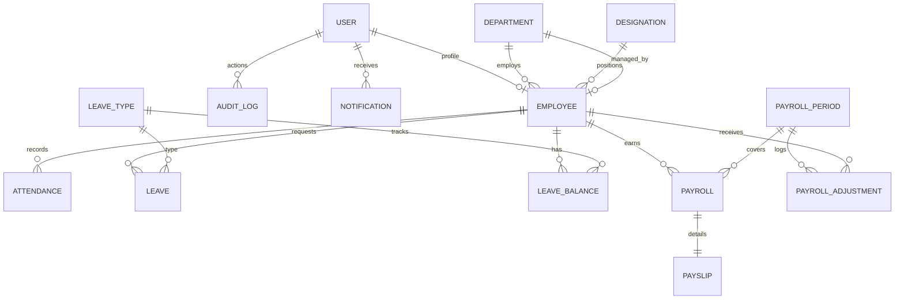

# Enterprise Staff Payroll Management System Implementation Plan

This document outlines the architecture, database design, directory structure, security protocols, payroll engine, and deployment steps for building a complete enterprise-grade Staff Payroll Management System from scratch.

## User Review Required

> [!IMPORTANT]
> **MySQL Database Credentials & Connection:**
> The system is configured to connect to local MariaDB/MySQL (XAMPP installation) on port `3306` with user `root` and no password by default. We will programmatically check and create the database `payroll_db` if it does not exist during migrations.
> Please verify if this matches your preferred dev environment database setup, or if specific credentials should be used.

> [!WARNING]
> **Python Dependencies to be Installed:**
> The project requires `djangorestframework` (for RESTful APIs) and `pymysql` (to connect Django to MariaDB/MySQL since `mysqlclient` requires compilation tools that may not be available on your Windows environment). We will run `pip install djangorestframework pymysql` as the first step of execution.

---

## Open Questions

> [!NOTE]
> 1. **Email Configurations:** For email notifications (payslip alerts, leave approvals), we will use Django's console email backend (`django.core.mail.backends.console.EmailBackend`) for development. Do you want to configure real SMTP settings at this stage?
> 2. **Late Penalty Rules:** The default late penalty rule will deduct $10 (or equivalent base currency) for every late entry after the first 3 late entries in a month. Should this be a fixed amount or a percentage of the basic salary?

---

## Proposed Changes

We will create a new modular Django project named `payroll_system` with the following apps:
1. `accounts`: Custom User model, Roles (RBAC), and authentication.
2. `employees`: Employee profiles, departments, designations, documents.
3. `attendance`: Check-in/out logs, QR codes, correction requests.
4. `leaves`: Leave type configurations, leave requests, approval flows.
5. `payroll`: Monthly periods, salary adjustments, payroll processing engine, holidays.
6. `payslips`: Payslip record generation, PDF payslips, history, and email triggers.
7. `core`: Audit logging, notifications, settings, and base styling layouts.

### 1. Database Schema Design (MySQL / MariaDB)

The tables will be mapped to Django models and run in MySQL. Below is the normalized relational structure:



#### SQL Schema Script (`database_schema.sql`)
We will create a clean SQL script representing the schema for reference. Key tables include:
- `accounts_user`: Custom auth table tracking lockouts (`is_locked`, `failed_login_attempts`), role choice, IP.
- `employees_employee`: Profile, codes, DOJ, designation, department, and salary structures.
- `attendance_attendance`: Check-in, check-out, status, total hours.
- `leaves_leave`: Request parameters, multi-level approvals (`manager_approved_by`, `hr_approved_by`).
- `payroll_payroll`: Summarized basic salary, allowances, deductions, net salary.
- `payslips_payslip`: Code, generated PDF reference, email sent status.
- `core_auditlog`: Action, module, timestamp, IP, old/new JSON values.

---

### 2. Django Directory Structure
We will initialize the project using the following structure:
```
c:\Users\CC-Lab79\Desktop\intern-project\
├── requirements.txt
├── manage.py
├── database_schema.sql
├── payroll_system/
│   ├── __init__.py
│   ├── settings.py
│   ├── urls.py
│   └── wsgi.py
└── apps/
    ├── accounts/
    │   ├── models.py       # Custom User model, Group assignments
    │   ├── views.py        # Login, Logout, Forgot Password, Lockout handling
    │   ├── forms.py        # Authentication & recovery forms
    │   └── urls.py
    ├── employees/
    │   ├── models.py       # Employee, Department, Designation, EmployeeDocument
    │   ├── views.py        # Profiles, CRUD views (manager and HR only)
    │   ├── serializers.py  # DRF API serializers
    │   └── urls.py
    ├── attendance/
    │   ├── models.py       # Attendance, AttendanceCorrection
    │   ├── views.py        # Check-in dashboard, QR camera scanning, Correction requests
    │   ├── services.py     # QR generation and verification
    │   └── urls.py
    ├── leaves/
    │   ├── models.py       # LeaveType, Leave, LeaveBalance
    │   ├── views.py        # Apply leave, HR/Manager approval workflow views
    │   └── urls.py
    ├── payroll/
    │   ├── models.py       # PayrollPeriod, Payroll, PayrollAdjustment, Holiday
    │   ├── services.py     # Payroll Engine (net salary formulas, tax computations)
    │   ├── views.py        # Processing panels, locked actions, salary registers
    │   └── urls.py
    ├── payslips/
    │   ├── models.py       # Payslip
    │   ├── services.py     # ReportLab PDF Generator, Email Dispatcher
    │   ├── views.py        # Payslip viewer, Download PDF endpoint, history list
    │   └── urls.py
    └── core/
        ├── models.py       # AuditLog, SystemSetting, Notification
        ├── middleware.py   # Audit logger middleware, session timeout monitor
        ├── views.py        # Dashboard widgets, centralized reports panel, notifications feed
        └── urls.py
```

---

### 3. Core Modules & Code Implementation Details

#### A. Authentication & Custom RBAC (`accounts`)
- Custom User Model extends `AbstractUser` with fields for `role`, `failed_attempts`, `is_locked`, `locked_until`, `last_ip`.
- **RBAC Groups:** Five standard Groups are created programmatically (`SuperAdmin`, `HRAdmin`, `PayrollOfficer`, `DeptManager`, `Employee`) with distinct permission rules.
- **Lockout Logic:** Standard Django login views are customized. 5 consecutive failed logins lock the user account for 15 minutes.
- **Session Timeout:** Enforced globally via `settings.py` config:
  `SESSION_COOKIE_AGE = 1800` (30-minute idle auto-logout)

#### B. Payroll Processing Engine (`payroll/services.py`)
Calculates net salaries for the month:
1. **Total Monthly Standard Working Days:** Calculates days excluding weekends and official system-defined `Holiday` objects.
2. **Attendance Factor:** Calculates days present + half days (0.5) + approved paid leaves. Calculates unpaid absent days.
3. **Leave Deduction:** Deducts `Unpaid Days * (Basic Salary / Standard Working Days)`.
4. **Late Penalty:** Deducts $10 for every "Late Entry" beyond 3 occurrences.
5. **Overtime Calculation:** Overtime hours (accumulated from check-out times exceeding standard 8-hour shift by >30 mins) multiplied by hourly rate `(Basic / Standard Working Days / 8) * 1.5`.
6. **Statutory Deductions:**
   - **PF (Provident Fund):** 12% of Basic Salary.
   - **ESI (Employee State Insurance):** 0.75% of Basic Salary.
   - **Professional Tax:** Based on income slabs.
   - **Income Tax (TDS):** Fixed deduction or custom percentage.
7. **Net Salary Formula:**
   $$\text{Net Salary} = \text{Basic Salary} + \text{HRA} + \text{DA} + \text{Travel} + \text{Medical} + \text{Bonus} + \text{Overtime Pay} - (\text{PF} + \text{ESI} + \text{PT} + \text{TDS} + \text{Leave Deductions} + \text{Late Penalties})$$

#### C. ReportLab PDF & openpyxl Excel Generation (`payslips/services.py`, `core/views.py`)
- **PDF Payslips:** Draws a high-quality tabular breakdown of earnings, deductions, employee code, month/year, and net salary. Includes a digital signature/stamp graphic area.
- **Salary Register (Excel):** Compiles an Excel sheet utilizing `openpyxl` with styled headers, auto-fit columns, total formulas, listing every component for all employees.

#### D. Notification Dispatcher
- Dispatches in-app notifications to database `Notification` table.
- Dispatches emails on specific triggers (leave approval, payslip ready) using a clean, professional HTML email template.

#### E. Security & Middleware (`core/middleware.py`)
- **Audit Logging:** Custom middleware intercepts POST/PUT/DELETE requests, comparing pre-save and post-save instances to record changes (`old_value` vs `new_value` in JSON format), tracking IP address, module, and operator user.
- **Input Sanitization:** Intercepts and parses all query params and post parameters.
- **File Upload Validator:** Inspects files uploaded to `EmployeeDocument`. Validates that MIME type is exactly `application/pdf`, `image/jpeg`, or `image/png` and file size < 5MB.

#### F. Premium UI Design & Dashboards (`core/templates`, `core/static`)
- Use a **custom style sheet** overriding Bootstrap 5 defaults.
- Curated color scheme: HSL slate dark-blue sidebar (`#0f172a`), deep indigo gradients for primary actions (`#4f46e5` to `#6366f1`), light canvas background (`#f8fafc`).
- Visuals: Uses **Chart.js** for animated monthly payroll costs, attendance distributions, and leaves trends.
- Responsive flexbox grid cards with micro-animations on hover.

---

### [NEW] [database_schema.sql](file:///c:/Users/CC-Lab79/Desktop/intern-project/database_schema.sql)
We will output a full database creation script mapping out standard MySQL tables for external references.

---

## Verification Plan

### Automated Tests
1. **Model Testing:** Run unit tests for models (`pytest` or `python manage.py test`) ensuring foreign keys and constraints behave correctly.
2. **Payroll Engine Tests:** Run calculation assertion tests checking basic salary math, overtime multipliers, and leave deductions.
3. **RBAC Tests:** Verify that endpoints throw `403 Forbidden` for users lacking proper permissions (e.g. Employee accessing payroll logs).

### Manual Verification
1. **Visual Theme Inspection:** Launch development server, log in as HR Admin/Super Admin, inspect the Sidebar, responsiveness on mobile width, and tables.
2. **Payslip Generation & Download:** Trigger payroll calculation, lock payroll, generate a payslip, and verify that the generated PDF downloads correctly.
3. **Audit Log Verification:** Edit an employee profile, check the audit logs database/view to ensure the transaction IP and changed attributes were correctly serialized.
